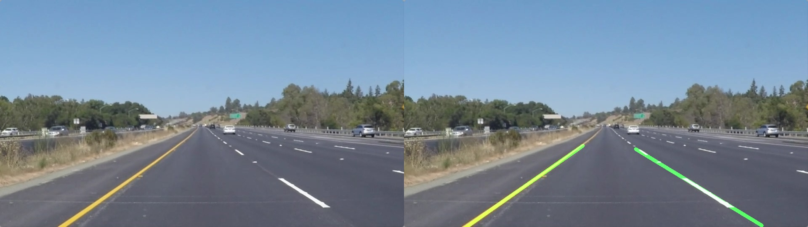

[toc]

# LaneDetectionV1.0

[](https://github.com/liuyangly1/LaneDetectionV1.0) [](https://blog.csdn.net/liuyang_1106)

**基于Opencv的车道线检测**：

1. 图像加载；
2. 图像预处理：
3. 图片灰度化，高斯滤波；
4. Cany边缘检测；
5. 感兴趣区域检测；
6. 霍夫直线检测 ；
7. 直线拟合；
8. 车道线叠加；
9. 图片和视频测试；
10. 可视化界面pyqt5。



## Requirements - 必要条件

- python 3.x
- numpy
- matplotlib
- opencv-python

## Usage - 用法

```bash
$ git clone git@github.com:liuyangly1/LaneDetectionV1.0.git
$ cd LaneDetectionV1.0
$ pip install -r requirements.txt
# 图片测试
$ python .\LaneDetectionV1.0.py -i ./Assets/1.jpg -o ./Assets/1_out.jpg
# 视频测试
$ python .\LaneDetectionV1.0.py -i ./Assets/project_video.mp4 -o ./Assets/project_video_out.mp4
```

## Changelog - 更新日志

- Todo：可视化界面

## License - 版权信息

[MIT](https://choosealicense.com/licenses/mit/)

## Reference - 参考

[01-陈光-无人驾驶技术入门（十四）| 初识图像之初级车道线检测-知乎](https://zhuanlan.zhihu.com/p/52623916)

